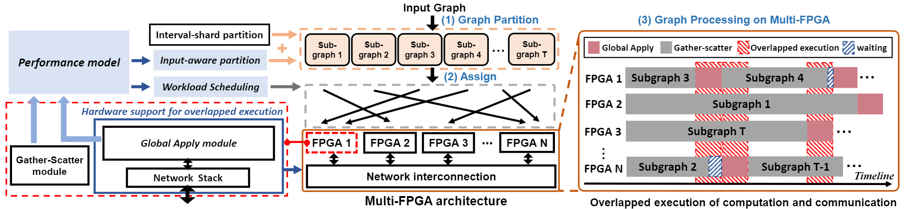

### Clementi: A Scalable Multi-FPGA Graph Processing Framework

## Introduction
Clementi is a scalable, multi-FPGA based graph processing framework designed to achieve near-linear scalability. By overlapping communication with computation, Clementi optimizes end-to-end performance. Additionally, leveraging a custom hardware architecture in FPGA, we propose a performance model and a workload scheduling method to minimize execution time discrepancies among FPGAs. Our experimental results demonstrate that Clementi significantly outperforms existing multi-FPGA frameworks, achieving speedups ranging from 1.86× to 8.75×, and exhibits near-linear scalability as the number of FPGAs increases.

## Update Notice

Please note that the documentation is actively being updated. If you encounter any inconsistencies or missing information, rest assured that it is part of our ongoing effort to provide comprehensive and up-to-date documentation. For any question, please contact this email: dcsyufeng@gmail.com.

## Prerequisites
Clementi development utilizes the Xilinx Vitis toolset. Key components include:
- **Xilinx XRT** version 2.14.354
- **Vitis v++** at v2021.2 (64-bit)
- **OpenMPI** at 4.1.4

The framework is executed on the HACC cluster at NUS. For detailed information and access to this cluster, please refer to the [HACC_NUS website](https://xacchead.d2.comp.nus.edu.sg/). Each FPGA on this cluster is paired with a virtual CPU node, utilizing OpenMPI for distributed execution. The specific version used is Open MPI 4.1.4, and the system incorporates four [Xilinx U250 FPGAs](https://docs.amd.com/r/en-US/ug1120-alveo-platforms/U200-Gen3x16-XDMA-base_2-Platform).

## System Overview

Clementi utilizes a three-phase approach to process large graphs on multi-FPGA platforms with a ring topology:
1. **Graph Partitioning:** The input edge list is initially partitioned into subgraphs using a 2D partitioning method that integrates interval-shard and input-aware partition.
2. **Subgraph Assignment:** A performance model predicts execution times for each subgraph, which informs a greedy-based scheduling algorithm to ensure balanced workloads across the FPGAs.
3. **Concurrent Processing:** Each FPGA concurrently processes its assigned subgraphs, overlapping gather-scatter and global apply stages to optimize performance.

## Initialization
In order to generate this design you will need a valid [UltraScale+ Integrated 100G Ethernet Subsystem](https://www.xilinx.com/products/intellectual-property/cmac_usplus.html) license [installation](#Licence-Installation) in Vivado. 

To begin working with Clementi, clone the repository using the following command:
```bash
git clone --recursive https://github.com/Xtra-Computing/Clementi.git
```
## Build Hardware
```bash
# Load the Xilinx Vitis and XRT settings
source /opt/Xilinx/Vitis/2021.2/settings64.sh
source /opt/xilinx/xrt/setup.sh

# Build all components for the Clementi application
# dependencies:
sudo apt install libgraphviz-dev faketime
pip3 install graphviz

# make with the default configuration (as in app makefile)
make TARGET=hw all APP=clementi TYPE=pr # make with specified target
# or 
make TARGET=hw all APP=gather_scatter TYPE=pr
# or
make TARGET=hw all APP=global_apply
# or
make TARGET=hw all APP=single_gas TYPE=pr
```

## Build Software
```bash
#If you only need to build software code, use the following command:
make host APP=clementi
# or 
make host APP=gather_scatter
# or
make host APP=global_apply
```

## Test
Run the hardware single graph processor script to test the system. Ensure that you have the correct OpenMPI settings configured before running the multiple FPGAs demo:
```bash
## For test gather_scatter module:
./script/run_gather_scatter.sh
## For test global_apply module:
./script/run_global_apply.sh

## For test single_gas, first login a U250 FPGA node, then:
./single_gas.app -d R25 -s 10 ## dataset = R25, and superstep = 10.
```
[Note] please pay attention to the graph dataset directory.

## Repository Structure

- `app` - Contains applications used within the project.
- `host` - Host files for the XRT driver.
- `images` - Images used in the README documentation.
- `mk` - Directory containing makefiles.
- `partition` - Includes the input-aware partition method and performance model.
- `src` - Hardware files for each block in the Clementi framework.
- `test` - Contains test files and scripts.
- `host_file` - Host files used in MPI code.
- `script` - Bash scripts in compilation.


## Licenses

**Ethernet/cmac** License: [BSD 3-Clause License](THIRD_PARTY_LIC.md)

**NetLayers/100G-fpga-network-stack-core** License: [BSD 3-Clause License](THIRD_PARTY_LIC.md)

## License Installation

Here is the simple solution for install cmac license using linux command:
```bash
## Step 1. Source the Vitis settings script:
source /path/to/Vitis/settings64.sh
## Step 2. Set the license file environment variable:
export XILINXD_LICENSE_FILE=/path/to/your/license.lic
## Step 3. To check the IP status in your project:
## a. Start Vivado in TCL mode:
vivado -mode tcl
## b. Open your project:
open_project /path/to/your/project.xpr
## c. Generate a report for all IP statuses and save it to a file:
report_ip_status -all > /path/to/ip_status_report.txt
## d. Close the project and exit the Vivado TCL shell:
close_project
exit
```